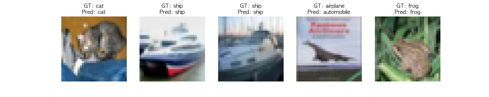

# 🧠 CIFAR-10 이미지 분류 with ResNet-18 (PyTorch)

본 프로젝트는 PyTorch를 활용하여 구현한 **ResNet-18** 모델로 **CIFAR-10** 이미지 분류를 수행합니다.  
Apple Silicon(M1/M2/M3)의 MPS(GPU)와 CPU 환경에서 각각 학습을 진행하고, 성능 비교를 통해 분석합니다.

---

## 📂 프로젝트 구조

```
ResNet-18/
├── .gitignore             # Git 추적 제외 파일 목록
├── model.py               # ResNet-18 모델 정의
├── train.py               # 학습 스크립트
├── predict.py             # 테스트 및 시각화
├── requirements.txt       # 의존성 목록
├── resnet18.pth           # 학습된 모델 가중치
├── predictions.png        # 예측 결과 시각화 이미지
├── loss_accuracy.png      # 손실값과 정확도 변화 시각화 이미지
└── README.md              # 설명 문서
```

---

## 📌 주요 내용

- ✅ PyTorch 기반 ResNet-18 모델 구현  
- ✅ CIFAR-10 데이터셋 분류 (10가지 클래스)  
- ✅ Apple M1/M2 GPU (MPS)와 CPU에서 각각 학습  
- ✅ 테스트셋 정확도 및 시각화 제공  
- ✅ 정규화, 시드 고정, 정확도 평가 반영  

---

## 🖼️ CIFAR-10 클래스

- `airplane`, `automobile`, `bird`, `cat`, `deer`,  
 `dog`, `frog`, `horse`, `ship`, `truck`

---

## ⚙️ 실행 방법

### 1. 환경 구성

```bash
pip install -r requirements.txt
```

### 2. 학습 실행

```bash
python train.py
```

> ✅ `torch.device("mps" if torch.backends.mps.is_available() else "cpu")`를 통해 자동으로 MPS(GPU) 또는 CPU 선택

### 3. 예측 및 정확도 평가

```bash
python predict.py
```

> 첫 5개 이미지에 대한 예측을 시각화하고, 전체 테스트셋 정확도를 출력합니다.

---

## 🧾 예측 결과 시각화

아래는 테스트셋 첫 5개 이미지에 대해 모델이 예측한 결과입니다.  
각 이미지 위에는 실제 정답(GT)과 모델의 예측(Pred)이 함께 표시됩니다.

<p align="center">
  
</p>

---

## 📊 성능 비교

| 디바이스 | 학습 시간 | 훈련 정확도 (Epoch 10) | 테스트 정확도 |
|----------|-----------|-------------------------|----------------|
| **CPU**  | 약 7시간  | 97.20%                  | **83.19%**     |
| **MPS**  | 약 40분   | 96.95%                  | **82.30%**     |

> 🎯 테스트셋 정확도는 `predict.py`에서 실제 CIFAR-10 테스트셋에 대해 평가한 결과입니다.

---

## 🧪 사용 기술

- Python 3.10.11  
- PyTorch (MPS 지원 포함)  
- torchvision  
- matplotlib  
- numpy  

---

## 🛠️ 주요 구성 요소

### `model.py`

- `CustomResNet`, `Block` 클래스  
- ResNet-18 구조 (2-2-2-2 블록 구성)  
- 출력 클래스 수: 10  

### `train.py`

- 훈련 로직  
- 학습률, Epoch 수, 배치 사이즈 조절 가능  
- 모델 저장:

```python
torch.save(model.state_dict(), "resnet18.pth")
```

### `predict.py`

- 저장된 모델 불러오기  
- 첫 5개 테스트 이미지 예측 + 시각화 (`predictions.png`)  
- 전체 정확도 출력:

```python
print(f"Test Accuracy: {accuracy:.2f}%")
```

---

## 🔁 재현성 설정 (선택사항)

```python
import torch, random, numpy as np

def set_seed(seed=42):
    torch.manual_seed(seed)
    np.random.seed(seed)
    random.seed(seed)
    if torch.backends.mps.is_available():
        torch.mps.manual_seed(seed)
```

---

## 🔍 참고 자료

- [ResNet 논문 — *Deep Residual Learning for Image Recognition*](https://arxiv.org/abs/1512.03385)  
- [CIFAR-10 데이터셋](https://www.cs.toronto.edu/~kriz/cifar.html)  
- [PyTorch MPS 공식 문서](https://pytorch.org/docs/stable/notes/mps.html)  

---

## 📜 라이선스

MIT License

